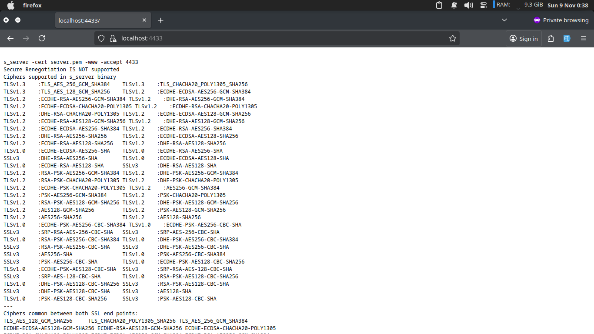
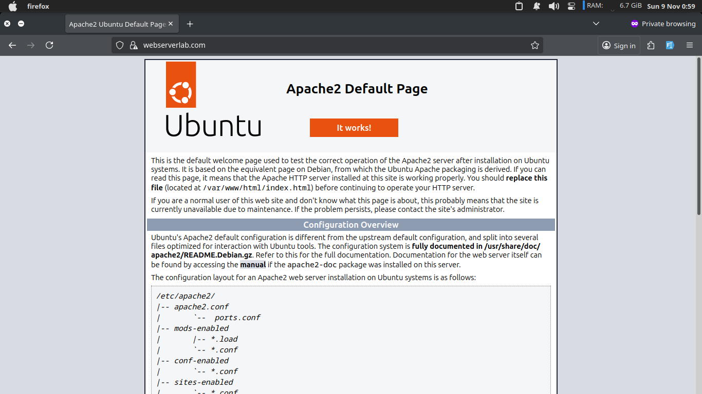
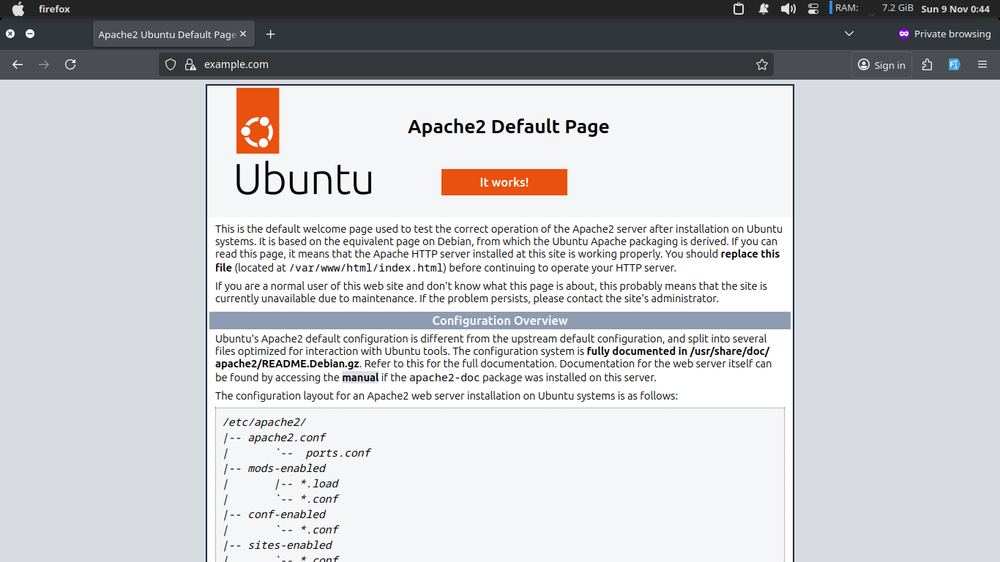

# Lab 5 Report: Securing Apache Web Server

## Task 1: Becoming a Certificate Authority

### Objective

Create a root Certificate Authority (CA) and use it to issue digital certificates for web servers. Unlike commercial CAs like VeriSign, this lab creates a self-signed root CA certificate.

### Setup

**1. Configuration File Setup**

The OpenSSL configuration file (`openssl.cnf`) was copied from `/usr/lib/ssl/openssl.cnf` and placed in the working directory. The following subdirectories were created as specified in the configuration:

- `demoCA/certs/` - Directory for issued certificates
- `demoCA/crl/` - Directory for Certificate Revocation Lists
- `demoCA/newcerts/` - Directory for new certificates
- `demoCA/index.txt` - Empty file for certificate database
- `demoCA/serial` - File containing serial number (e.g., "1000")

**2. CA Certificate Generation**

A self-signed certificate for the root CA was generated using the following command:

```bash
openssl req -new -x509 -keyout ca.key -out ca.crt -config openssl.cnf
```

**Output Files:**

- `ca.key` - CA's private key (password protected)
- `ca.crt` - CA's public-key certificate (self-signed)

**Information Provided:**

- Country Name: BD (Bangladesh)
- State/Province: Sylhet
- Locality: Sylhet
- Organization: SUST_IICT
- Common Name: [CA Name]
- Password: [Set for CA key protection]

### Creating Certificate for example.com

**Step 1: Generate RSA Key Pair**

```bash
openssl genrsa -out webserverlab.key 2048
```

This command generates a 2048-bit RSA key pair without password protection (for server use). The key is stored in `webserverlab.key`.

**Step 2: Generate Certificate Signing Request (CSR)**

```bash
openssl req -new -key webserverlab.key -out webserverlab.csr -config openssl.cnf
```

**CSR Information:**

- Country Name: BD
- State/Province: Sylhet
- Locality: Sylhet
- Organization: SUST_IICT
- Organizational Unit: section
- Common Name: webserverlab.com
- Email Address: admin@webserverlab.com
- Challenge Password: 1234
- Optional Company Name: webserverlab.com

**Step 3: Sign Certificate with CA**

```bash
openssl ca -in webserverlab.csr -out webserverlab.crt -cert ca.crt -keyfile ca.key -config openssl.cnf
```

**Certificate Details:**

- Serial Number: 1003 (0x1003)
- Validity: Nov 8 18:58:32 2025 GMT to Nov 8 18:58:32 2026 GMT (365 days)
- Subject: /C=BD/ST=Sylhet/L=Sylhet/O=SUST_IICT/OU=section/CN=webserverlab.com/emailAddress=admin@webserverlab.com
- X509v3 Extensions:
  - Basic Constraints: CA:FALSE
  - Subject Key Identifier: 9A:23:D1:50:A2:8F:2F:5F:FA:5E:BA:BD:EC:23:50:B5:24:B0:5A:6F
  - Authority Key Identifier: D7:D8:C5:17:A8:50:9A:5B:53:96:B8:FE:6E:5F:91:4E:FC:08:01:F2

---

## Task 2: Testing with OpenSSL Server

### Objective

Test the generated certificates using OpenSSL's built-in SSL server before deploying to Apache.

### Implementation

**Step 1: Combine Key and Certificate**

```bash
cp server.key server.pem
cat server.crt >> server.pem
```

This creates a single PEM file containing both the private key and certificate, which is required by OpenSSL's s_server command.

**Step 2: Launch OpenSSL Server**

```bash
openssl s_server -cert server.pem -www
```

The server listens on port 4433 by default.

### Browser Configuration

**Importing CA Certificate into Browser**

Since the CA certificate is self-signed and not recognized by browsers, it must be manually imported:

**Firefox:**

1. Preferences → Advanced → View Certificates
2. Click "Import" and select `ca.crt`
3. Select "Trust this CA to identify web sites"
4. The CA certificate is now in Firefox's trusted certificate list

**Chrome:**

1. Settings → Privacy and Security → Security → Manage Certificates
2. Import `ca.crt` and trust it for identifying websites

### Checkpoint 1: OpenSSL Server with example.com (5 Marks)

**Accessing the Server:**

1. **Via example.com:**

   - URL: `https://example.com:4433`
   - Since example.com points to 127.0.0.1, this resolves to localhost

2. **Via localhost:**
   - URL: `https://localhost:4433`
   - Direct access using localhost

**Screenshot: HTTPS via localhost:4433**


**Observations:**

1. **Initial Warning:** Before importing the CA certificate, browsers display a security warning:

   - "example.com:4433 uses an invalid security certificate"
   - "The certificate is not trusted because the issuer certificate is unknown"

2. **After CA Import:** After importing `ca.crt` into the browser:

   - The browser recognizes the CA as trusted
   - The certificate chain is validated successfully
   - HTTPS connection is established with a secure padlock icon
   - The OpenSSL server displays the SSL connection information

3. **Certificate Chain:**

   - The server certificate (example.com) is signed by our CA
   - The browser validates the chain: example.com → Our CA (root)
   - Since our CA is trusted, the entire chain is valid

4. **HTTPS Protocol:**
   - The connection uses TLS/SSL encryption
   - All data between browser and server is encrypted
   - The padlock icon indicates a secure connection

**Explanation:**

The HTTPS connection works as follows:

1. Browser sends a request to the server with supported cipher suites
2. Server responds with its certificate and selected cipher suite
3. Browser verifies the certificate chain (server cert → CA cert)
4. Browser generates a session key and encrypts it with the server's public key
5. Server decrypts the session key with its private key
6. Both parties use the session key for symmetric encryption of all subsequent data

### Checkpoint 2: OpenSSL Server with webserverlab.com (5 Marks)

**Process:**

The same procedure was followed for `webserverlab.com`:

1. Generated RSA key pair: `webserverlab.key`
2. Created CSR with Common Name: `webserverlab.com`
3. Signed certificate with CA: `webserverlab.crt`
4. Combined key and certificate into `webserverlab.pem`
5. Launched OpenSSL server with the certificate
6. Accessed via `https://webserverlab.com:4433`

**Screenshot: HTTPS via webserverlab.com**


**Observations:**

- Successfully accessed webserverlab.com via HTTPS on port 4433
- Certificate validation works correctly after CA import
- Secure connection established with proper encryption
- Server displays SSL connection details

---

## Task 3: Deploy HTTPS into Apache

### Objective

Deploy HTTPS capability into the Apache web server for the virtual hosts configured in Web Lab 1.

### Implementation

**Step 1: Enable SSL Module**

```bash
sudo a2enmod ssl
```

This enables the SSL module in Apache, which is required for HTTPS functionality.

**Step 2: Configure Virtual Host for HTTPS**

The virtual host configuration file for `example.com` was updated to include HTTPS support:

```apache
<IfModule mod_ssl.c>
<VirtualHost *:443>
    ServerAdmin admin@example.com
    ServerName example.com
    ServerAlias www.example.com
    DocumentRoot /var/www/example.com/html
    ErrorLog ${APACHE_LOG_DIR}/error.log
    CustomLog ${APACHE_LOG_DIR}/access.log combined

    SSLEngine on
    SSLCertificateFile /etc/apache2/ssl/webserverlab.crt
    SSLCertificateKeyFile /etc/apache2/ssl/webserverlab.key
</VirtualHost>
</IfModule>
```

**Step 3: Copy Certificates to Apache SSL Directory**

```bash
sudo cp webserverlab.crt /etc/apache2/ssl/
sudo cp webserverlab.key /etc/apache2/ssl/
```

**Step 4: Set Proper Permissions**

```bash
sudo chmod 644 /etc/apache2/ssl/webserverlab.crt
sudo chmod 600 /etc/apache2/ssl/webserverlab.key
```

- Certificate file: Readable by Apache (644)
- Private key: Only readable by owner (600) for security

**Step 5: Test Apache Configuration**

```bash
sudo apache2ctl configtest
```

**Output:** `Syntax OK`

This confirms that the Apache configuration is correct and there are no syntax errors.

**Step 6: Restart Apache**

```bash
sudo systemctl restart apache2
```

**Apache Status:**

```
● apache2.service - The Apache HTTP Server
     Loaded: loaded (/usr/lib/systemd/system/apache2.service; disabled; preset: enabled)
     Active: active (running) since Sun 2025-11-09 00:59:23 +06
       Docs: https://httpd.apache.org/docs/2.4/
    Process: 71713 ExecStart=/usr/sbin/apachectl start (code=exited, status=0/SUCCESS)
   Main PID: 71773 (apache2)
      Tasks: 55 (limit: 16443)
     Memory: 6.7M (peak: 8.5M)
        CPU: 42ms
```

Apache is running successfully with SSL support enabled.

### Checkpoint 3: HTTPS on Apache for example.com (5 Marks)

**Accessing the Server:**

- URL: `https://example.com`
- Port: 443 (default HTTPS port)

**Screenshot: HTTPS via example.com**


**Observations:**

1. **Secure Connection:** The website loads successfully over HTTPS
2. **Certificate Validation:** The browser validates the certificate chain correctly
3. **Padlock Icon:** The secure padlock icon appears in the address bar
4. **No Warnings:** After importing the CA certificate, no security warnings are displayed
5. **Encrypted Communication:** All data between browser and server is encrypted using TLS/SSL

**Configuration Verification:**

- SSL module is enabled and loaded
- Virtual host is configured for port 443
- Certificate and key files are properly referenced
- Apache is listening on port 443
- HTTPS connection is established successfully

### Checkpoint 4: HTTPS on Apache for webserverlab.com (5 Marks)

**Process:**

The same HTTPS configuration was applied to `webserverlab.com`:

1. Created certificate for webserverlab.com (as shown in Task 1)
2. Configured virtual host for HTTPS on port 443
3. Copied certificate and key to `/etc/apache2/ssl/`
4. Set proper file permissions
5. Tested configuration and restarted Apache
6. Accessed via `https://webserverlab.com`

**Screenshot: HTTPS via webserverlab.com**


**Observations:**

- Successfully configured HTTPS for webserverlab.com
- Certificate is properly signed by our CA
- Secure connection established on port 443
- Website loads correctly with encryption
- No security warnings after CA certificate import
