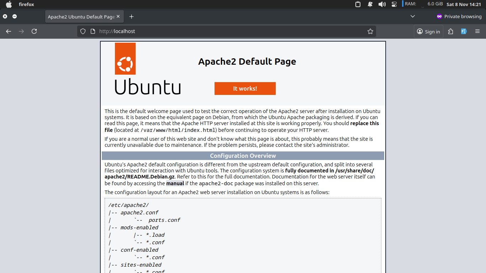
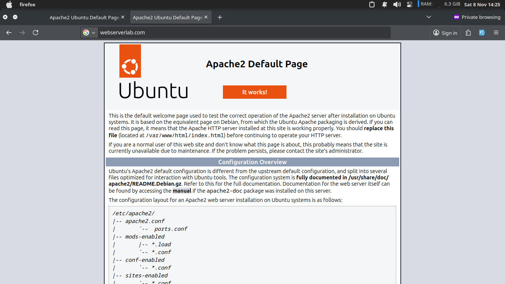
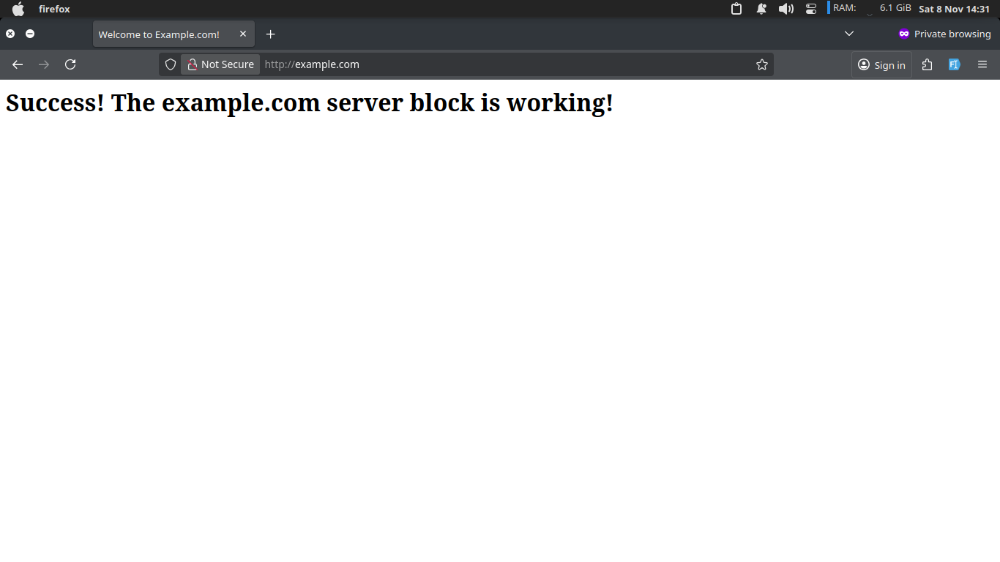
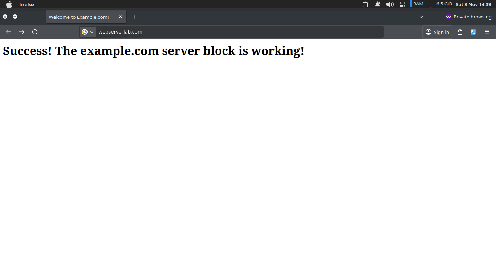
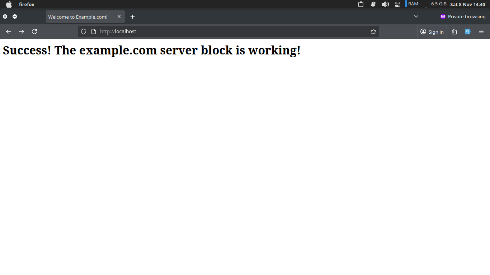
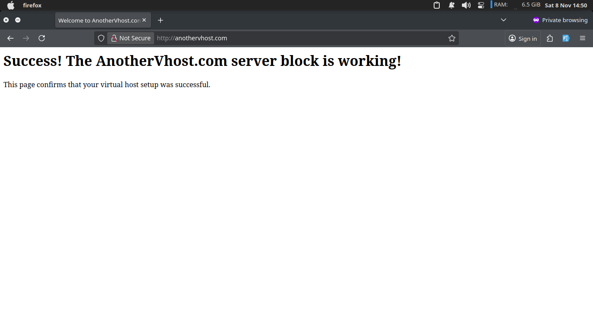
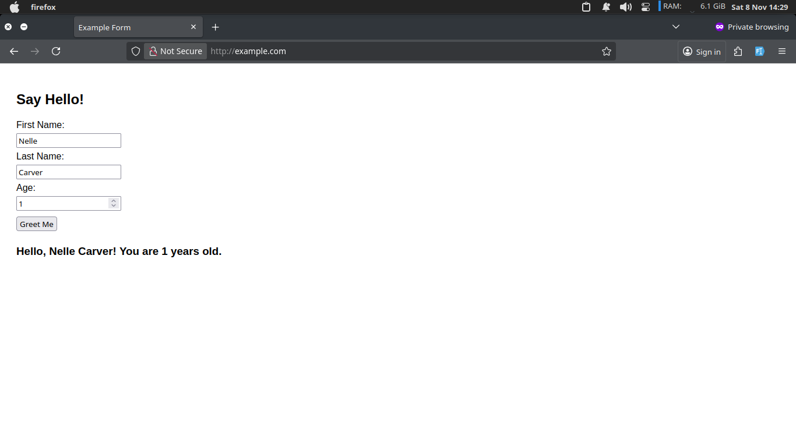
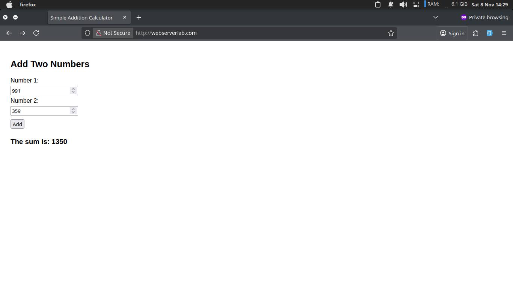

# Web Lab 1 Report: Apache Web Server Installation & Maintenance

## Task 1: Setting up an Apache Web Server

### Installation and Configuration

The Apache web server was installed on Ubuntu using the following commands:

```bash
sudo apt update
sudo apt install apache2
```

After installation, the firewall was configured to allow HTTP traffic:

```bash
sudo ufw allow 'Apache'
sudo ufw status
```

The Apache service was verified to be running:

```bash
sudo systemctl status apache2
```

### Domain Configuration

To facilitate testing, the domain name `webserverlab.com` was mapped to localhost by adding the following entry to `/etc/hosts`:

```
127.0.0.1 webserverlab.com
```

### Checkpoint 1: Default Apache Landing Page (2 Marks)

The Apache web server was successfully installed and configured. The default Apache landing page was accessed using both `localhost` and `webserverlab.com` to verify the installation.

**Screenshot 1: Accessing via localhost**


**Screenshot 2: Accessing via webserverlab.com**


Both methods successfully displayed the default Apache web page, confirming that Apache is working correctly.

---

## Task 2: Setting up Virtual Hosts

### Step 1: Managing Apache Process

The following commands were used to manage the Apache service:

- **Stop**: `sudo systemctl stop apache2`
- **Start**: `sudo systemctl start apache2`
- **Restart**: `sudo systemctl restart apache2`
- **Reload**: `sudo systemctl reload apache2`
- **Enable at boot**: `sudo systemctl enable apache2`

### Step 2: Setting up a Single Virtual Host (example.com)

A virtual host was created for `example.com` following these steps:

1. **Created directory structure:**

   ```bash
   sudo mkdir -p /var/www/example.com/html
   sudo chown -R $USER:$USER /var/www/example.com/html
   sudo chmod -R 755 /var/www/example.com
   ```

2. **Created index.html file** at `/var/www/example.com/html/index.html`:

   ```html
   <html>
     <head>
       <title>Welcome to Example.com!</title>
     </head>
     <body>
       <h1>Success! The example.com server block is working!</h1>
     </body>
   </html>
   ```

3. **Created virtual host configuration** at `/etc/apache2/sites-available/example.com.conf`:

   ```apache
   <VirtualHost *:80>
   ServerAdmin admin@example.com
   ServerName example.com
   ServerAlias www.example.com
   DocumentRoot /var/www/example.com/html
   ErrorLog ${APACHE_LOG_DIR}/error.log
   CustomLog ${APACHE_LOG_DIR}/access.log combined
   </VirtualHost>
   ```

4. **Enabled the site and disabled default:**
   ```bash
   sudo a2ensite example.com.conf
   sudo a2dissite 000-default.conf
   sudo apache2ctl configtest
   sudo systemctl restart apache2
   ```

### Checkpoint 2: example.com Virtual Host (5 Marks)

The virtual host for `example.com` was successfully configured and tested. The site displays the custom content as expected.

**Screenshot: example.com virtual host**


The virtual host is working correctly, serving content from `/var/www/example.com/html` instead of the default Apache directory.

### Checkpoint 3: Understanding Virtual Host Behavior (4 Marks)

After enabling the `example.com` virtual host and disabling the default configuration, the following observations were made:

**Behavior Analysis:**

1. **http://webserverlab.com**: When accessing `webserverlab.com`, Apache serves the `example.com` virtual host because:

   - The default site (000-default.conf) was disabled
   - Apache uses the first available virtual host as the default when no matching ServerName or ServerAlias is found
   - Since `example.com` was the only enabled virtual host, it became the default

2. **http://127.0.0.1**: Accessing via IP address also serves the `example.com` virtual host for the same reason - it becomes the default when no specific match is found.

**Screenshot 1: webserverlab.com behavior**


**Screenshot 2: localhost behavior**


**Explanation:**
Apache's virtual host matching works by comparing the `Host` header in the HTTP request against the `ServerName` and `ServerAlias` directives. When no match is found, Apache uses the first virtual host in alphabetical order (or the first enabled one) as the default. This is why both `webserverlab.com` and `127.0.0.1` resolve to the `example.com` virtual host when the default site is disabled.

### Step 3: Setting up Multiple Virtual Hosts

A second virtual host was created for `anothervhost.com` following the same procedure:

1. Created directory structure at `/var/www/anothervhost.com/html`
2. Created a custom `index.html` with different content
3. Created virtual host configuration at `/etc/apache2/sites-available/anothervhost.com.conf`
4. Enabled the site and restarted Apache

### Checkpoint 4: Multiple Virtual Hosts (4 Marks)

The second virtual host `anothervhost.com` was successfully configured and tested. Both virtual hosts (`example.com` and `anothervhost.com`) are now working independently.

**Screenshot: anothervhost.com virtual host**


Both virtual hosts are functioning correctly, demonstrating the ability to host multiple websites on a single Apache server.

---

## Task 3: Hosting Dynamic Websites using HTML and JavaScript

### Implementation

Two dynamic websites were created using HTML and JavaScript, each hosted on separate virtual hosts. Each website includes HTML forms that accept user input and use JavaScript to handle form submissions and process the data dynamically.

### Dynamic Website Features

Both websites include:

- HTML forms with input fields (2-3 values)
- JavaScript event handlers for form submission
- Client-side processing and validation
- Dynamic content display based on user input

### Checkpoint 5: Dynamic Websites Deployment (5 Marks)

Two dynamic websites were successfully deployed on separate virtual hosts, demonstrating the integration of HTML forms with JavaScript for interactive web functionality.

**Screenshot 1: Dynamic website on example.com virtual host**


**Screenshot 2: Dynamic website on webserverlab.com virtual host**


Both dynamic websites are fully functional, accepting user input through forms and processing the data using JavaScript to provide interactive user experiences.
